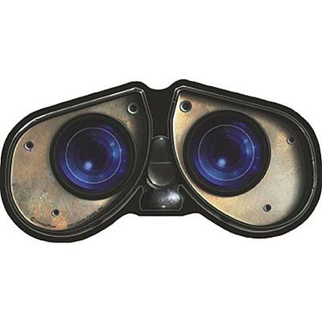

# crtx_vision_module
This project contains the modules to run the vision module for sorting garments.

<!-- PROJECT LOGO -->
<br />
<p align="center">
  <a>
    
  </a>

  <h3 align="center">Computer vision module to process images in the sorting place</h3>

  <p align="center">
    An awesome README template to jumpstart your projects!
    <br />
    <a href="https://github.com/othneildrew/Best-README-Template"><strong>Explore the docs »</strong></a>
    <br />
    <br />
    <a href="https://github.com/othneildrew/Best-README-Template">View Demo</a>
    ·
    <a href="https://github.com/othneildrew/Best-README-Template/issues">Report Bug</a>
    ·
    <a href="https://github.com/othneildrew/Best-README-Template/issues">Request Feature</a>
  </p>
</p>


<!-- TABLE OF CONTENTS -->
<details open="open">
  <summary>Table of Contents</summary>
  <ol>
    <li>
      <a href="#about-the-project">About The Project</a>
      <ul>
        <li><a href="#built-with">Built With</a></li>
      </ul>
    </li>
    <li>
      <a href="#getting-started">Getting Started</a>
      <ul>
        <li><a href="#prerequisites">Prerequisites</a></li>
        <li><a href="#installation">Installation</a></li>
      </ul>
    </li>
    <li><a href="#usage">Usage</a></li>
    <li><a href="#contact">Contact</a></li>
  </ol>
</details>


<!-- ABOUT THE PROJECT -->
## About The Project

This module allows the platform to save image frames from the camera when the aruco marker is not visible.

Some characteristics of the module are:
* The module launch at NUC's startup.
* The module has a dynamic configure menu to set up the recording variables.
* The module converts the raw image through a perspective transform and crops the defined work area.

The module depends on an [aruco markers](https://docs.opencv.org/3.4/d5/dae/tutorial_aruco_detection.html) setup. A setup example should look like follows: 

<p align="center">
  <a>
    
  </a>
</p>

### Built With

This section should list any major frameworks that you built your project using. Leave any add-ons/plugins for the acknowledgements section. Here are a few examples.
* [ROS Melodic Morenia](http://wiki.ros.org/melodic)
* [OpenCV](https://opencv.org/)
* [Python](https://www.python.org/)


<!-- GETTING STARTED -->
## Getting Started

There is three working modes (WM) to work with the module:
* WM1: From the NUC.
* WM2: From an external computer through ssh.
* WM3: From an external computer setting the ROS_MASTER on the NUC.

### Prerequisites

##### Setup the working area
It is essential to configure the working area with the proper aruco markers. 

It is possible to create the markers online at [https://chev.me/arucogen/](https://chev.me/arucogen/).

The module uses the following setup: 

* Dictionary 4x4(50, 100, 250, 1000). 
* Four 100mm aruco markers on the corners (id's: 5, 6, 7, 8).
* One 200mm aruco marker on the middle for the recording task (id: 9).
* The aruco markers positions in relation to their id's are: 
  bottom_left: 8, bottom_right: 5, upper_right: 6, upper_left: 7
  
If you need a different setup please use the dynamic reconfiguration of the node to specify the arrangement. 

##### Working mode 1
To install the OS and configuration on the NUC from scratch please follow the 
[crtx_vision_module-config](https://github.com/richrdcm/crtx_vision_module-config) repository.

##### Working mode 2
Be sure to install ssh services

* ssh server
  ```sh
  sudo apt-get install openssh-server
  ```
* ssh client
  ```sh
  sudo apt-get install openssh-client
  ```
  
Enable the ssh service by typing
  ```sh
  sudo systemctl enable ssh
  ```
##### Working mode 3

Get and install desktop-full ROS Melodic Morenia, follow the instructions here: 

[http://wiki.ros.org/melodic/Installation/Ubuntu](http://wiki.ros.org/melodic/Installation/Ubuntu).

Get the additional packages:

* dynamic-reconfigure
  ```sh
  sudo apt-get install ros-melodic-dynamic-reconfigure

* vision-msgs
  ```sh
  sudo apt-get install ros-melodic-vision-msgs
  
### Installation

1. Create a working space:
    ```sh
   mkdir -p crtx_ws/src

2. Clone the repo inside the /src directory
   ```sh
   cd crtx_ws/src
   git clone https://github.com/richrdcm/crtx_vision_module.git
   ```
3. Build the packages
   ```sh
   cd..
   catkin build
   ```
4. Source the working environment
   ```sh
   source devel/setup.bash
   ```


<!-- USAGE EXAMPLES -->
## Usage

Run the main launchfile
   ```sh
   roslaunch data_base_recorder recorder.launch
   ```

This will open the rqt gui. On the dynamic reconfigure tab you have some adjustable parameters:

* On usb_cam: Choose the jpeg compression rate, th resulting image is published on /usb_cam/compressed which is used
  by the aruco markers node to find the working area.
* On data_base_recorder: Choose the directory where the database is going to be saved. Pause or start the recording.
Choose the topic to be recorded. Choose the aruco markers arrangement. 


<!-- ROSLAUNCH FILES -->
## Roslaunch files

To configure individual nodes have in mind the following roslaunch files which you can modify:

* main recorder launch: data_base_recorder/launch/recorder.launch
* perspective transformation: perspective_transformation/launch/perspective_transformation.launch
* arudo detector: fiducials/aruco_detect/launch/aruco_detect.launch
* usb_cam: usb_cam/launch/usb_cam_crtx.launch

<!-- CONTACT -->
## Contact

Ricardo Carrillo -  ricardo.carrillo@fu-berlin.de

Project Link: [https://github.com/richrdcm/crtx_vision_module](https://github.com/richrdcm/crtx_vision_module)


